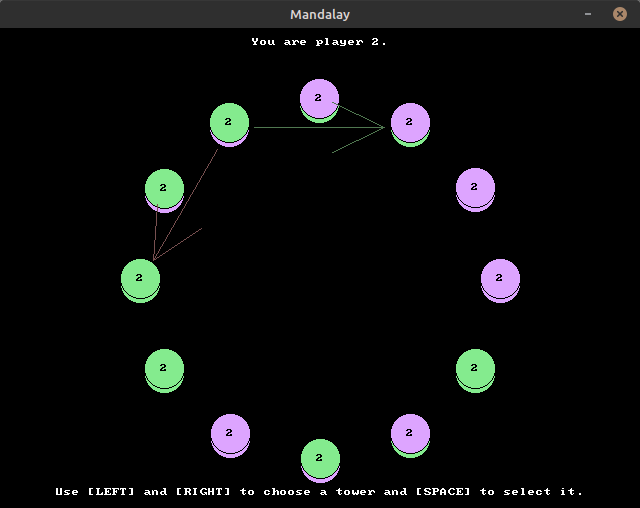

# Mandalay over Network

Mandalay is a light board game for two players. This program allows you to play Mandalay over a network. It was written in 2008 in the span of a few hours.
Thanks to [Simon](https://github.com/SimonN/) for bringing up the game to me, and for refining my code to a cleaner state.

## How To Build

Mandalay works on Windows and Linux. It requires the [Allegro 4 library](https://liballeg.org/old.html).

Either use the included Makefile to build it -- just invoke `make` -- or, on Windows, run `Build.bat`.

If you have trouble building Mandalay -- perhaps due to Allegro 4 being outdated -- you can run it as a Docker container. See *Docker Image* below.

## How to Run

Both players need to agree who will run the *host* and who will run the *client*.
The network address of the *host* must be reachable from the *client*.
The *host* player simply runs Mandalay. The game window appears, showing the message "Waiting for client on port 1234...".
The *client* player runs Mandalay with the host address as the command-line argument. If you are running both the host and client on the same machine, connect to localhost: `./Mandalay 127.0.0.1`.

Once the client is connected, the game starts from a randomized initial position. 

## How to Play

The game explains the controls at the bottom of the screen. It uses the space bar and the left and right arrow keys.

When it is your turn, select a tower controlled by you with the arrow keys, then press SPACE. Choose the clockwise (RIGHT) or counter-clockwise (LEFT) direction of the move with the corresponding arrow key. Then wait for your next turn.

A yellow arrow indicates the last move, together with a yellow mark on the moved chip.

In the end position, the game announces the winner. Press any key to quit the program.

## Rules

The board consists of a circular arrangement of towers of chips. The 24 chips come in two colors: 12 chips of one color for each player.
In this program, the colors are chosen at random at the start of each game.

A player *controls* a tower if its topmost chip is that player's color.

The game starts with 12 towers. The chip arrangement is random, but each player initially controls six towers.

You win the game when it is your opponent's turn and they have no more legal moves.

To make a *move*, the player to move takes the top chip from one of their controlled towers and places it on another tower at a distance, either way around the circle, that matches the height of the source tower.
For example, if you control a tower of 3 chips, you may take your top chip and place it on top of the third-next tower in clockwise or counter-clockwise direction.

If the moved chip was the last one in its tower (that is, it had a height of 1), then its neighboring towers now become neighbors. The gap in the circle is eliminated and there is now one fewer tower on the board.

The maximum height for a tower is 5. Chips cannot be moved to or across towers of maximum height. Maximum-height towers can drastically limit the move options for the players.

## Settings

The program reads settings from the file `settings.txt` in a space-separated `<key> <value>` format. Lines that start with `#` are comments. The default `settings.txt` contains comments that describe all the available properties.

## Docker Image

Mandalay is available as a Docker image. This can be convenient to resolve problems with compiling the game.
If you want to run this image, you first need to install [Docker](https://www.docker.com/).

The command to run it is encapsulated in `RunContainer.sh`. As with the game itself, the server player should just run the script without arguments. The client must pass the server's hostname or address as commandline argument.

The script will automatically pull the image from Docker Hub. You can also build it yourself based on the `Dockerfile` included with this repository. Just run `docker build -t mandalay .`.

Problems may emerge because the image needs a lot of extra permissions to run: free access to the host's IPC devices, network and X server socket. It will not work on systems where X11 is not available.
